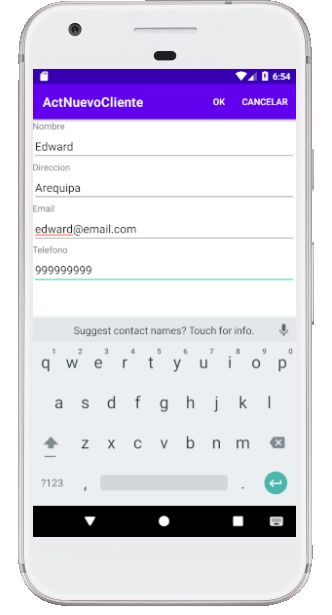
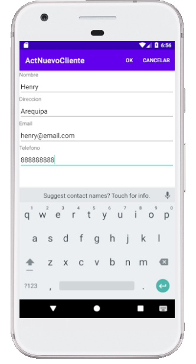
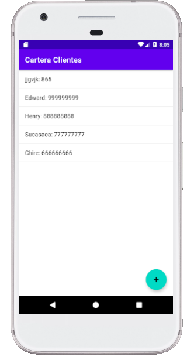

# Laboratorio 6: Android App + Base de Datos
## CarteraClientes

**Objetivo:** Crear una aplicación Android con conexión a Base de Datos

**Actividades:** Crear un Proyecto Android Studio "CarteraClientes" en base al ejemplo visto en clases

1. Replicar el proyecto mostrado en clase: Cartera de Clientes

  - **Funcionalidades:** Lista de Clientes, Nuevo Cliente

2. Actualizar el proyecto siguiendo las recomendaciones de la página oficial de desarrollo android: Cómo guardar datos con SQLite (https://developer.android.com/training/data-storage/sqlite)
 
2. Ejecutar el proyecto

## Evidencias de ejecución

